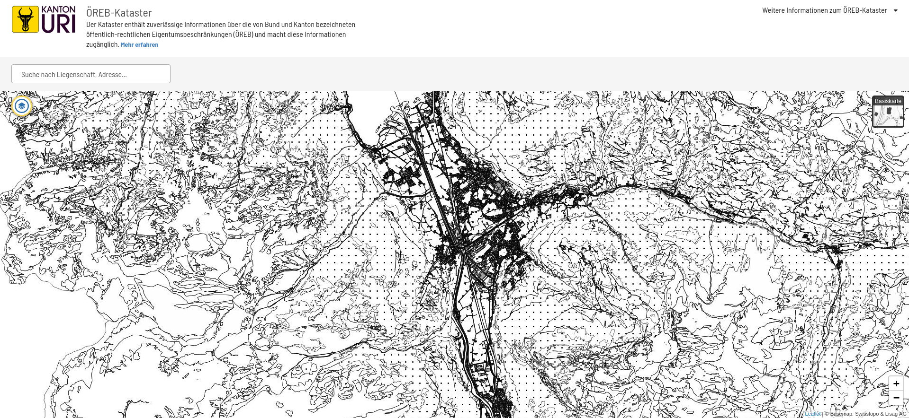
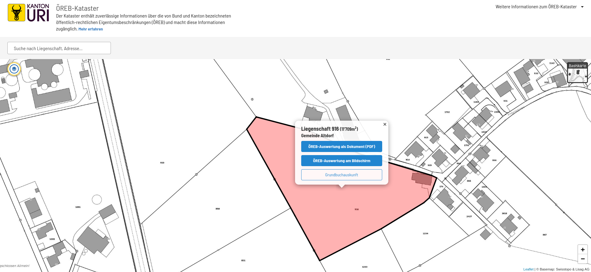
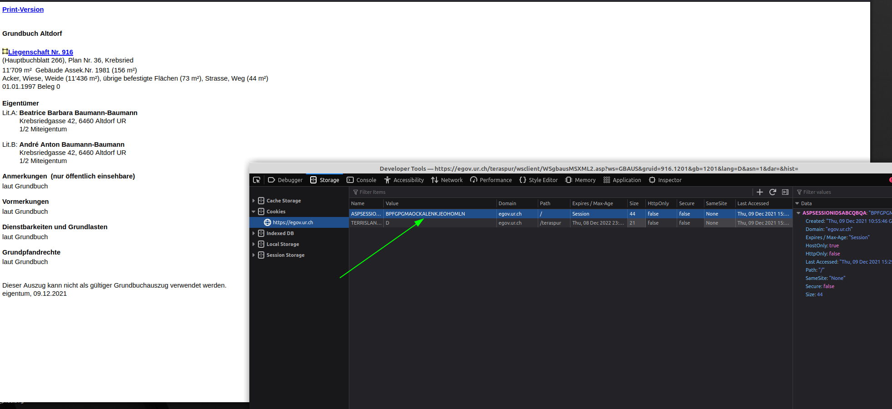

# DNIP

proof of concept. This is not by any mean complete and solely demonstrate the systematic analysis and persistence of the gathered responses.

## Documentation

### Get Session ID

1. visit https://oereb.ur.ch/

2. select any parcel

3. select "Grundbuchauskunft"
4. A fairly simple site from egov.ur.ch should have opend by now
5. open your devtools 
6. open the storage tab
7. select from cookies the `APSPSESSOPMODSABCQBQA` value

### Run the app
`php dnip grundbuch`
